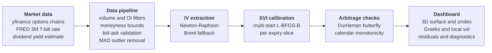
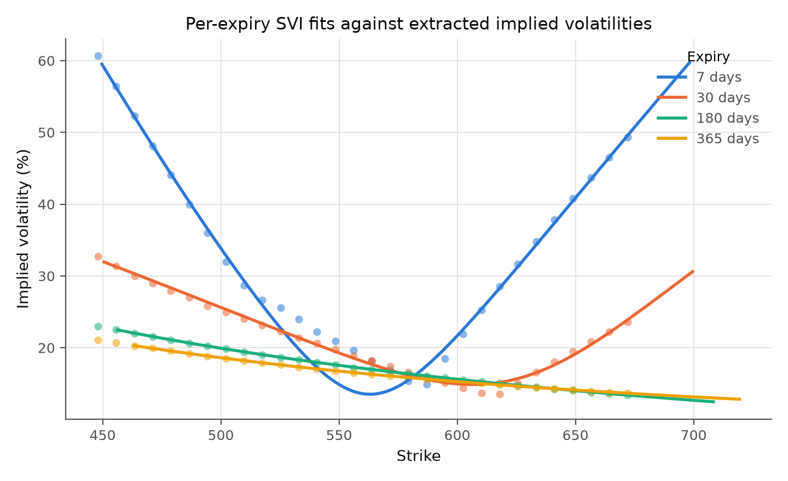
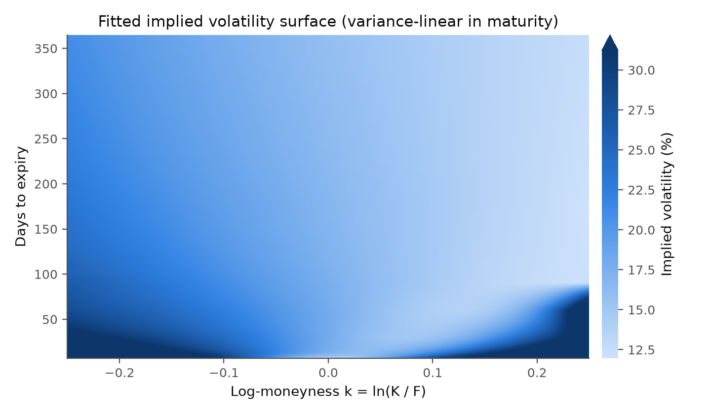
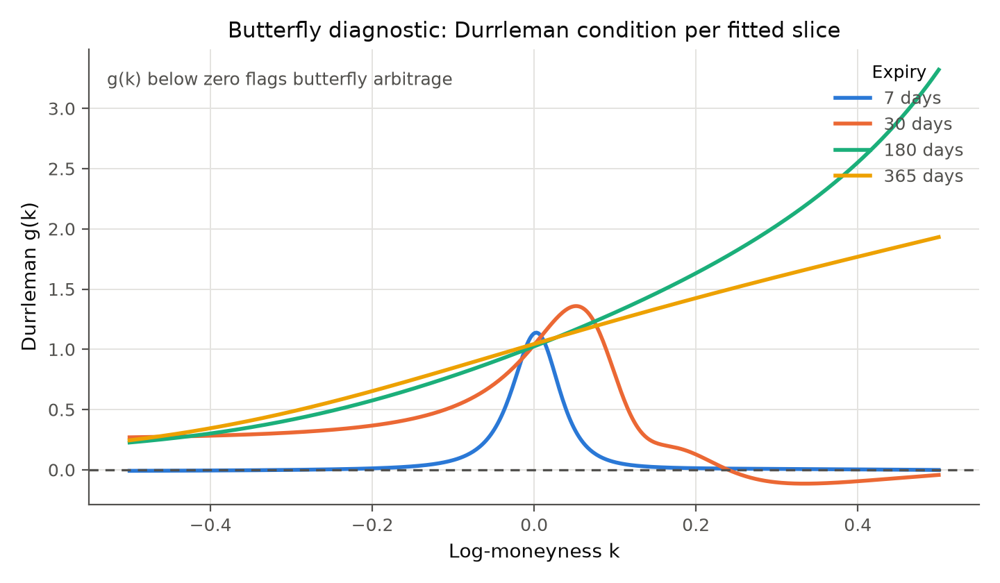

# Volatility Surface Engine

[](https://github.com/CameronScarpati/vol-surface-engine/actions/workflows/ci.yml)

A learning project: an end-to-end volatility surface tool that fetches live equity options data, extracts implied volatility via Newton-Raphson root-finding, calibrates per-expiry SVI parameterizations (Gatheral 2004), checks no-arbitrage conditions (Durrleman's butterfly condition and calendar-spread monotonicity) and reports violations as diagnostics, and exposes the full surface, including Dupire local vol, Greeks, and residual diagnostics, through an interactive Streamlit dashboard.

**5,700+ lines of Python** across a modular numerical engine (1,680 lines), interactive dashboard (2,189 lines), and a test suite (1,890 lines, 160 tests). Built from scratch with a focus on numerical robustness and clean architecture. It is exploratory rather than production pricing infrastructure; see [Scope and Limitations](#scope-and-limitations).

---

## What It Does



---

## Results

The figures below come from running the full pipeline on the bundled synthetic options chain (`data/spy_options.parquet`), so anyone can reproduce them offline with one command:

```bash
python scripts/generate_readme_figures.py
```

The chain is generated from known smile and term-structure formulas with a fixed seed, which makes it a controlled testbed: the fits below recover structure that is known to be there, and the numbers say nothing about fit quality on live market data.



*Per-expiry SVI fits over Newton-Raphson extracted implied volatilities. Average R² across the 8 slices is 0.995 on this chain.*



*The fitted surface, interpolated linearly in total variance between expiry slices. The color scale clips the extreme short-dated wings at the 97th percentile so the smile shape stays visible.*



*The butterfly diagnostic in action: g(k) for the 30-day slice dips below zero, and the check reports that violation rather than repairing the fit. On this synthetic chain the diagnostics flag butterfly violations on the four shortest slices and calendar-ordering violations on several adjacent pairs.*

---

## Technical Highlights

| Component | Implementation | Why It Matters |
|-----------|---------------|----------------|
| **IV Extraction** | Newton-Raphson with Brenner-Subrahmanyam seed + Brent fallback; $\varepsilon < 10^{-10}$ | Robust convergence even in low-vega regions where naïve solvers fail |
| **SVI Calibration** | 5-parameter raw SVI per slice; multi-start L-BFGS-B (8 seeds); OI-weighted objective | Captures smile shape with low total-variance RMSE (< 0.01 on synthetic round-trip data) while avoiding local minima |
| **Arbitrage Diagnostics** | Durrleman butterfly condition $g(k) \geq 0$; calendar-spread $\partial w / \partial T \geq 0$ | Detects static-arbitrage violations and flags them; a penalized arbitrage-aware refit is implemented but is not enabled in the default build (the surface is arbitrage-checked, not guaranteed arbitrage-free) |
| **Local Volatility** | Dupire (1994) via analytic SVI derivatives + finite-difference $\partial w / \partial T$; Gaussian-smoothed output | Extracts instantaneous diffusion coefficient implied by the market |
| **Greeks** | Black-Scholes $\Delta$, $\Gamma$, $\nu$, $\Theta$ across full (strike, $T$) grid | Continuous Greeks surfaces rather than per-contract point estimates |
| **Data Pipeline** | Adaptive multi-stage filtering: volume/OI, moneyness bounds, bid-ask validation, MAD-based outlier removal | Handles noisy real-world data: wide spreads flagged, stale quotes removed |
| **Dashboard** | 8 interactive Plotly panels in Streamlit; live + synthetic modes | Full analytical toolkit: 3D surface, smile slices, delta-space, residual heatmap, arbitrage diagnostics |
| **Testing** | 160 tests (pytest); unit tests per module, golden values pinned to external references, end-to-end integration; CI on Python 3.10–3.12 | Round-trip IV recovery plus values computed outside the codebase (textbook Black-Scholes cases, high-precision recomputation, a known arbitrage-violating SVI slice from the literature) |

---

## Methodology

<details>
<summary><strong>Implied Volatility Extraction</strong></summary>

IV is extracted from market mid-prices using Newton-Raphson root-finding on the Black-Scholes pricing function with continuous dividend yield:

$$C = S e^{-qT} N(d_1) - K e^{-rT} N(d_2)$$

$$d_1 = \frac{\ln(S/K) + (r - q + \sigma^2/2)T}{\sigma\sqrt{T}}, \quad d_2 = d_1 - \sigma\sqrt{T}$$

The solver uses a Brenner-Subrahmanyam initial guess ($\sigma_0 \approx \sqrt{2\pi/T} \cdot C/S$) with Brent's method fallback for near-zero vega regions. Convergence: $|\Delta\text{price}| < 10^{-8}$ or $|\Delta\sigma| < 10^{-10}$.
</details>

<details>
<summary><strong>SVI Parameterization</strong></summary>

Each expiry slice is fit to the raw SVI model (Gatheral 2004), which parameterizes total implied variance as a function of log-moneyness $k = \ln(K/F)$:

$$w(k) = a + b\left[\rho(k - m) + \sqrt{(k - m)^2 + \sigma^2}\right]$$

Five parameters per slice: $a$ (variance level), $b$ (wing slope), $\rho$ (skew), $m$ (translation), $\sigma$ (curvature). Calibrated via multi-start L-BFGS-B with 8 random restarts to escape local minima.
</details>

<details>
<summary><strong>No-Arbitrage Diagnostics</strong></summary>

The surface is checked for static arbitrage via:

**Butterfly arbitrage.** The Durrleman (2005) condition requires the risk-neutral density to be non-negative:

$$g(k) = \left(1 - \frac{k w'}{2w}\right)^2 - \frac{(w')^2}{4}\left(\frac{1}{w} + \frac{1}{4}\right) + \frac{w''}{2} \geq 0 \quad \forall k$$

**Calendar-spread arbitrage.** Total variance must be non-decreasing in time: $\partial w / \partial T \geq 0$.

A penalized refit that escalates $\lambda$ to push $g(k) \geq 0$ is implemented (`fit_svi_arbitrage_free` in `arbitrage.py`), but the default `build_surface` pipeline only detects and reports violations through `generate_diagnostics`; it does not invoke the penalized refit. The surface is therefore arbitrage-checked, not guaranteed arbitrage-free.
</details>

<details>
<summary><strong>Local Volatility (Dupire)</strong></summary>

The fitted SVI surface is used to extract Dupire (1994) local volatility, the unique diffusion coefficient consistent with observed European option prices:

$$\sigma_{\text{loc}}^2(K,T) = \frac{\partial w / \partial T}{1 - \frac{k w'}{w} + \frac{w''}{2} - \frac{(w')^2}{4}\left(\frac{1}{w} + \frac{1}{4}\right)}$$

where the numerator uses finite differences across SVI slices and the denominator uses analytical SVI derivatives.
</details>

<details>
<summary><strong>Greeks & Delta-Space Analysis</strong></summary>

Black-Scholes Greeks ($\Delta$, $\Gamma$, $\nu$, $\Theta$) are computed from the fitted IV surface across the full (strike, $T$) grid. The dashboard includes delta-space smile views with approximate 25$\Delta$ risk-reversal and butterfly metrics (computed at fixed log-moneyness anchors rather than solved exact-delta strikes).
</details>

---

## Quick Start

```bash
git clone https://github.com/CameronScarpati/vol-surface-engine.git
cd vol-surface-engine

python -m venv .venv && source .venv/bin/activate
pip install -r requirements.txt

# Launch dashboard (synthetic mode works offline, live mode fetches real-time data)
streamlit run dashboard/app.py

# Run tests
python -m pytest tests/ -v
```

To fetch and cache live options data for any ticker:

```bash
python data/download.py              # default: SPY
python data/download.py --symbol AAPL
```

---

## Project Structure

```
vol-surface-engine/
├── .github/
│   └── workflows/ci.yml           # GitHub Actions CI (lint, format, types + test matrix)
├── data/
│   ├── download.py                # CLI: fetch real options data
│   └── spy_options.parquet        # Bundled synthetic chain (also the live-download cache path)
├── docs/
│   ├── smile_fits.png             # README figure: per-expiry SVI fits
│   ├── surface_heatmap.png        # README figure: fitted surface
│   └── durrleman_diagnostic.png   # README figure: butterfly diagnostic
├── src/
│   ├── __init__.py                # Public API: VolSurface, build_surface, …
│   ├── data_loader.py             # Options chain fetching + cleaning
│   ├── iv_engine.py               # Black-Scholes + Newton-Raphson IV solver
│   ├── svi_fitter.py              # SVI calibration per expiry slice
│   ├── arbitrage.py               # Durrleman + calendar-spread checks
│   └── surface.py                 # Pipeline orchestrator (VolSurface)
├── dashboard/
│   ├── app.py                     # Streamlit main app
│   └── components/
│       ├── helpers.py             # Shared computation helpers
│       ├── surface_3d.py          # 3D volatility surface (Plotly)
│       ├── smile_slice.py         # Per-expiry smile with bid-ask bands
│       ├── delta_smile.py         # Delta-space smile (25Δ RR/BF metrics)
│       ├── greeks.py              # Greeks surface (Δ, Γ, ν, Θ)
│       ├── local_vol.py           # Local volatility via Dupire's formula
│       ├── residual_heatmap.py    # Strike × expiry mispricing heatmap
│       ├── arbitrage_diag.py      # Durrleman g(k) + calendar diagnostics
│       └── term_structure.py      # ATM term structure + mispricing table
├── scripts/
│   ├── generate_synthetic_data.py # Synthetic data generator
│   ├── generate_readme_figures.py # Renders the README figures offline
│   └── plot_iv_smiles.py          # Quick IV smile visualization
├── tests/
│   ├── conftest.py                # Shared fixtures + synthetic data helpers
│   ├── test_data_loader.py        # Data layer unit tests
│   ├── test_iv_engine.py          # IV engine unit tests
│   ├── test_svi_fitter.py         # SVI fitter unit tests
│   ├── test_arbitrage.py          # Arbitrage diagnostics unit tests
│   ├── test_golden_values.py      # Golden values pinned to external references
│   └── test_integration.py        # End-to-end pipeline tests
├── LICENSE
├── pyproject.toml
├── requirements.txt
└── README.md
```

---

## Tech Stack

| Layer | Technologies |
|-------|-------------|
| **Numerical Engine** | Python, NumPy, SciPy (L-BFGS-B, Brent root-finding), Pandas |
| **Visualization** | Plotly (3D surfaces, interactive charts), Streamlit |
| **Market Data** | yfinance (options chains, spot prices), FRED API (risk-free rate) |
| **Testing & CI** | pytest (160 tests), GitHub Actions (Python 3.10–3.12 matrix) |
| **Code Quality** | Ruff (linting + formatting), mypy (type checking), pyproject.toml configuration |

---

## Scope and Limitations

This is a personal learning project for working through the mechanics of volatility surface construction. It is exploratory rather than production pricing infrastructure, and a few things are worth stating plainly:

- **Arbitrage is checked, not enforced.** The default `build_surface` pipeline fits SVI per slice and then runs `generate_diagnostics` to detect butterfly and calendar-spread violations. A penalized arbitrage-aware refit (`fit_svi_arbitrage_free`) exists but is not wired into the default build, so the surface is arbitrage-checked, not guaranteed arbitrage-free.
- **Accuracy numbers are on synthetic data.** The reported fit quality (R² and RMSE) comes from round-trip tests on synthetic Black-Scholes prices. RMSE is measured in total-variance space, not implied-vol points. Live yfinance chains are noisier, and fit quality on real data varies with liquidity and quote staleness.
- **Test scope.** The integration round-trip validates the IV engine (price to IV and back), and the golden-value suite pins module-level results (Black-Scholes prices, SVI values, Durrleman diagnostics) against references computed outside the codebase. There is still no end-to-end validation of SVI calibration, interpolation, Greeks, or local vol against an independent full-pipeline ground truth.
- **Approximate delta-space metrics.** The 25-delta risk-reversal and butterfly are computed at fixed log-moneyness anchors, not by solving for exact 25-delta strikes, so they are approximations of the desk convention.
- **Data dependence.** Live mode depends on yfinance option chains and a FRED risk-free rate; both can be incomplete or delayed, and the dashboard falls back to synthetic data when a fetch fails.

---

## References

1. Gatheral, J. (2004). *A Parsimonious Arbitrage-Free Implied Volatility Parameterization.* Global Derivatives & Risk Management.
2. Gatheral, J. & Jacquier, A. (2014). *Arbitrage-Free SVI Volatility Surfaces.* Quantitative Finance, 14(1).
3. Durrleman, V. (2005). *From Implied to Spot Volatilities.* PhD Thesis, Princeton University.
4. Black, F. & Scholes, M. (1973). *The Pricing of Options and Corporate Liabilities.* Journal of Political Economy.
5. Brenner, M. & Subrahmanyam, M.G. (1988). *A Simple Formula to Compute the Implied Standard Deviation.* Financial Analysts Journal.
6. Dupire, B. (1994). *Pricing with a Smile.* Risk Magazine, 7(1), 18-20.

---

## License

MIT. See [LICENSE](LICENSE).
